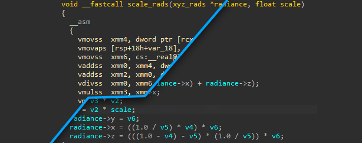

# MicroAVX - An AVX Lifter for the Hex-Rays Decompiler

## Overview

MicroAVX is an extension of the [IDA Pro](https://www.hex-rays.com/products/ida/) decompiler, adding partial support for a number of common instructions from Intel's [Advanced Vector Extensions](https://en.wikipedia.org/wiki/Advanced_Vector_Extensions) (AVX). This plugin demonstrates how the Hex-Rays microcode can be used to lift and decompile new or previously unsupported instructions.

There are no plans further develop MicroAVX, or extend its coverage to the complete set of AVX instructions. This plugin is labeled only as a prototype & code resource for the community.

For more information, please read the associated [blogpost](https://blog.ret2.io/2020/07/22/ida-pro-avx-decompiler).

## Releases

* v0.1 -- Initial release

## Installation

MicroAVX is a cross-platform (Windows, macOS, Linux) Python 2/3 plugin. It takes zero third party dependencies, making the code both portable and easy to install.

1. From your disassembler's python console, run the following command to find its plugin directory:
   - **IDA Pro**: `os.path.join(idaapi.get_user_idadir(), "plugins")`

2. Copy the contents of this repository's `/plugins/` folder to the listed directory.
3. Restart your disassembler.

This plugin is only supported for IDA 7.5 and newer.

## Usage

The MircoAVX plugin loads automatically when an x86_64 executable / IDB is opened in IDA. Simply attempt to decompile any function containing AVX instructions, and the the plugin will lift any instructions that it supports.

(please note, there is no right click 'AVX toggle' in this release)

## Authors

* Markus Gaasedelen ([@gaasedelen](https://twitter.com/gaasedelen))